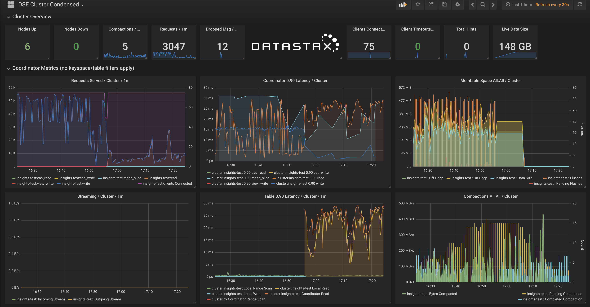
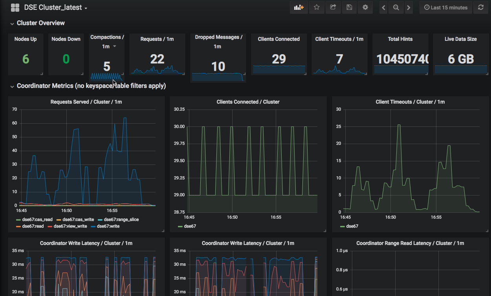

# DSE Metrics Collector Dashboards

This repository contains preconfigured Grafana dashboards that integrate with DSE Metrics Collector. Use DSE Metrics Collector to export DSE metrics to a monitoring tool like Prometheus, and then visualize DSE metrics in the Grafana dashboards.

Use Docker and modify the provided Prometheus configuration file, or manually export DSE metrics to an existing Prometheus server. Although the examples in the linked documentation use Prometheus as the monitoring tool, you can export the aggregated metrics to other tools like Graphite and Splunk.

## WARNING

Before start using the Docker examples provided in this repository, make sure you have a good understanding of Prometheus's default data rention period and how to adjust it, **to avoid unexpected metrics data lost**. By default, Prometheus is configured to only retain 15 days worth of data. If you want to keep longer history of your metrics data, you will need to revise the docker-compose.yml to add `--storage.tsdb.retention=` flag onto the prometheus runtime command line.

## Getting started

Clone this repository and then follow the instructions in the DataStax documentation based on your implementation:

* [Export and visualize metrics with Prometheus and Docker](https://docs.datastax.com/en/dse/6.7/dse-dev/datastax_enterprise/tools/metricsCollector/mcExportMetricsDocker.html)
* [Manually export and visualize metrics with Prometheus](https://docs.datastax.com/en/dse/6.7/dse-dev/datastax_enterprise/tools/metricsCollector/mcExportMetricsManually.html)

### Generation of the tg_dse.json file

In some cases, for example, if you have big cluster, the `tg_dse.json` file could be generated by one of the auxiliary scripts located in the `extras` directory (please note that these scripts are examples, and don't handle everything, like, authentication):

* `generate-discovery-file.sh`: it uses `nodetool` command to extract a list of servers in the cluster, and generate service discovery file. Script should be executed on the one of the nodes of cluster. Script accepts 2 parameters: 
  * name of file (required) to which the data will be written;
  * port (optional, default value is equal to 9103);
* `generate-discovery-file.py`: it uses [DSE Python driver](https://docs.datastax.com/en/developer/python-dse-driver/latest/) to fetch cluster metadata, and generate file. Script accepts 3 parameters:
  * contact point (required) that is used to connect to cluster;
  * name of file (required) to which the data will be written;
  * port (optional, default value is equal to 9103);

These scripts also could be used for periodic refresh of the `tg_dse.json` file to reflect changes in the cluster's topology.

## Support

The code, examples, and snippets provided in this repository are not "Supported Software" under any DataStax subscriptions or other agreements.

Slack - https://academy.datastax.com/slack #dse-metric-collector

## License

Please refer to [LICENSE](LICENSE.md) file.

## Examples

The following screenshots illustrate the preconfigured dashboards in this repository.

#### DSE Cluster Condensed

#### DSE System & Node Metrics

#### DSE Cluster Latest

#### Prometheus Statistics

